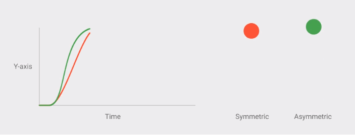
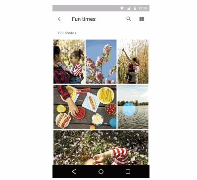

# 2. 动画

- 真实的动作

	1. 物体迅速的加速和平滑的减速会更加自然

		
	
	2. 物体突然运动和突然停止会显得相当生硬，同时线性动作也会显得机械化

		

	3. 任何物体进场和退场，都应处于最大速率

		
		
		上图（可取）
		
		
		
		上图（不可取）

	3. 物体动画的移动方式，要根据它们的重量做适当的调整
	
- 响应式交互

	1. 表层响应：触控会产生涟漪，诸如点击/释放、拖进/脱出

	
	
	
	2. 元素相应：以触控点为原点，展开新元素的的动画，这样用户才能将元素触控点和展开的卡片联系起来

	
		
	上图（可取）

	
		
	上图（不可取）

- 有意义的转场动画

	1. 视觉的连贯性：元素应当滑入视线，避免瞬间切屏出现

		
			
		上图（可取）
	
		
			
		上图（可取）

		
		
		上图（可取）
	
		
			
		上图（不可取）
- 打动用户的细节
# 等待更新······