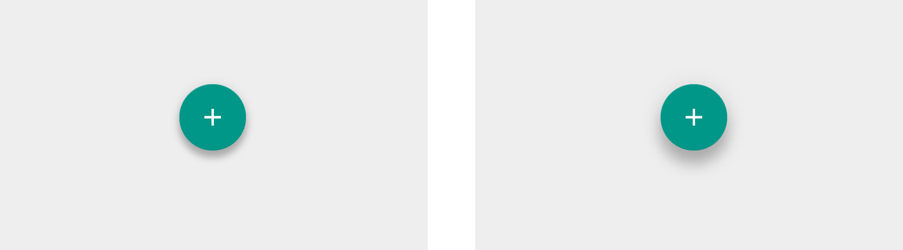

# 1. 概述

- Material Design核心思想：Google认为现实世界中的材质触感是可以通过**纸片**的隐喻来表达的，想将物理世界的体验带进屏幕。去掉现实中的杂质和随机性，保留其最原始纯净的形态、空间关系、变化与过渡，配合虚拟世界的灵活特性，还原最贴近真实的体验，达到简洁与直观的效果。
  	 
	

- 设计原则：实体感（**光效、表面质感、运动感**）

	 

- 设计环境：三维世界

	

- Material 属性：
	1. Z轴厚度为1dp，x、y轴高度、宽度均可改变
	
		
		
		上图（可取）
		
		
		
		上图（不可取）

	2. 高度和阴影：阴影是由于相对高度（Z轴位置）而产生
	
		

	3. 内容是被以任何形状和颜附在材料上面，并不会增加材料的厚度
		
		

	4. 内容展示要被限制在材料范围里
		
		
	
	5. 材料是实物，输入事件只影响材料的前景，不能穿过材料下面底部
		
		
		
		上图（可取）
		
		
		
		上图（不可取）
	
	6. 利用不同的高度区分材料的层叠，防止占用相同的空间点
		
		
		
		上图（可取）
		
		
		
		上图（不可取）
	
	7. 材料不能穿过其他材料
		
		
		
		上图（不可取）

	8. 材料应该仅沿着它的水平面增长和收缩，决不能弯曲或折叠
		
		
		
		上图（可取）
		
		
		
		上图（不可取）
	
	9. 材料可以分割和合并
		
		
		
		上图（可取）

- 高度和阴影：注意区分开层级，根据高度，进行深浅上色以达到阴影的效果
	
	

	

	
		
	上图（可取）

	
		
	上图（不可取）
		
	
		
	上图（不可取）

- 各元素参考阴影：静态和动态两种情况下对比
	
	1. 应用条：4dp
	
		

	2. 浮动按钮：静态：2dp；敲击状态：8dp

		

	3. 浮动动作按钮（FAB）：静态：6dp；敲击状态：12dp
	
		

	4. 卡片：静态：2dp；选中状态：8dp	
		
		

	5. 菜单和子菜单：菜单：8dp；子菜单：9dp（为子菜单增加 1dp）

		

	6. 对话框：24dp

		

	7. 导航抽屉和右抽屉：16dp

		

	8. 刷新按钮：3dp

		

	9. 快速查询/搜索条：静止状态：2dp；滚动状态：3dp

		

	10. 切换按钮：1dp

		